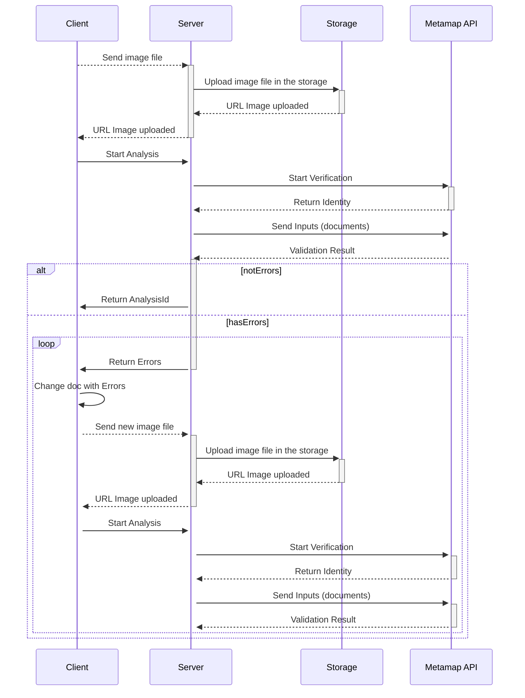

```mermaid
sequenceDiagram
    Client-->>+Server: Send image file
    Server->>+Storage: Upload image file in the storage
    Storage-->>-Server: URL Image uploaded
    Server-->>-Client: URL Image uploaded
    Client->>+Server: Start Analysis
    Server->>+Metamap API: Start Verification
    Metamap API-->>-Server: Return Identity
    Server->>+Metamap API: Send Inputs (documents)
    Metamap API-->>+Server: Validation Result
    alt notErrors
        Server->>+Client: Return AnalysisId
    else hasErrors
        loop 
            Server->>-Client: Return Errors
            Client->>+Client: Change doc with Errors
            Client-->>+Server: Send new image file
            Server->>+Storage: Upload image file in the storage
            Storage-->>-Server: URL Image uploaded
            Server-->>-Client: URL Image uploaded
            Client->>+Server: Start Analysis
            Server->>+Metamap API: Start Verification
            Metamap API-->>-Server: Return Identity
            Server->>+Metamap API: Send Inputs (documents)
            Metamap API-->>-Server: Validation Result
        end
    end
```
